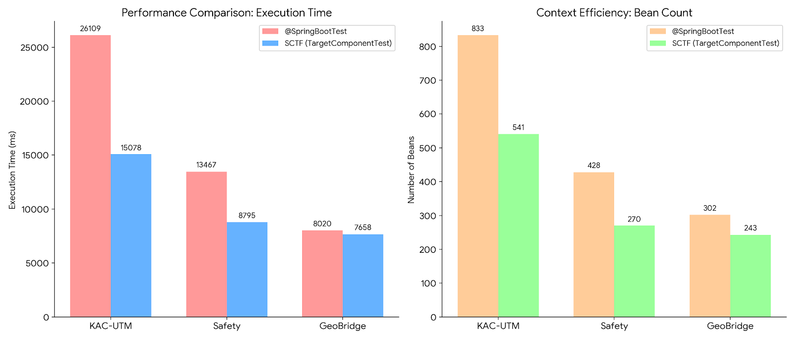

# SCTF Test Slice (`sctf-test-slice`)

> 🚀 **SpringBootTest의 느린 Context 초기화를 해결하기 위한 테스트 최적화 프레임워크**  
> 타겟 컴포넌트를 기준으로 **의존성 그래프를 추적하여 필요한 Bean만 로딩**하는 초경량 슬라이스 테스트 라이브러리

---

## 🔥 왜 만들었는가

Spring Boot 테스트에서 가장 큰 병목은 `@SpringBootTest`의 **ApplicationContext 초기화 비용**입니다.

- 불필요한 Bean까지 모두 로딩  
- Context Caching이 깨질 경우 성능 급격히 저하  
- 테스트 실행 시간이 수 초 이상 증가  

기존 슬라이스 테스트의 한계:

| 방식 | 한계 |
|------|------|
| `@WebMvcTest` | Service 레이어 Mock 강제 |
| `@DataJpaTest` | 비즈니스 로직 테스트 어려움 |
| `@SpringBootTest` | 과도한 Context 로딩 |

👉 **SCTF는 이 문제를 해결하기 위해 설계되었습니다**

> “필요한 Bean만 로딩하면 테스트는 더 빨라질 수 있다”

---

## ⚙️ 핵심 아이디어

SCTF는 다음 전략을 사용합니다:

- Reflection 기반 의존성 그래프 추적  
- 생성자 / 필드 주입을 따라가며 필요한 Bean만 선별  
- 최소한의 ApplicationContext 구성  

```
Target Component
   ↓
Constructor / Field Injection 추적
   ↓
연관 Bean 수집
   ↓
최소 Context 구성
```

**예시**
```
# @SpringBootTest (833개 전부 로딩)
OrderService, PaymentService, UserService ...

# SCTF (OrderService 기준 추적 → 필요한 것만)
OrderService          ← Target
├── PaymentService    ← 생성자 주입
...
```

---

## 🚀 성능 비교

> 실제 프로젝트 기준 테스트 결과

SCTF 프레임워크는 프로젝트 규모(Bean 개수)가 커질수록 **Startup Latency(컨텍스트 초기화 시간) 단축 효과**가 극대화됨을 확인했습니다. 대규모 프로젝트인 KAC-UTM 기준으로 **소요 시간이 42% 감소**하여 TDD 사이클 효율을 향상시켰습니다.

> - 측정 기준: 동일 테스트 클래스에서 `@BeforeAll` / `@AfterAll` 기준으로 Context 초기화 포함 전체 소요 시간을 측정



1. KAC-UTM (대규모 프로젝트)

| 항목 | @SpringBootTest | SCTF |
|------|----------------|------|
| Bean 수 | 833개 | 541개 |
| 실행 시간 | 26,109ms | 15,078ms |
| 개선율 | - | **약 1.73배 향상 (소요 시간 42% 감소)** |

2. Safety(사이드프로젝트)

| 항목 | @SpringBootTest | SCTF |
|------|----------------|------|
| Bean 수 | 428개 | 270개 |
| 실행 시간 | 13,467ms | 8,795ms |
| 개선율 | - | **약 1.53배 향상 (소요 시간 35% 감소)** |

3. GeoBridge(사이드프로젝트)

| 항목 | @SpringBootTest | SCTF |
|------|----------------|------|
| Bean 수 | 302개 | 243개 |
| 실행 시간 | 8,020ms | 7,658ms |
| 개선율 | - | **약 1.05배 향상 (소요 시간 5% 감소)** |
---

> - ⚠️ 프로젝트 특성에 따라 효과는 달라질 수 있습니다.
> -  Bean 제거 효과는 단순 개수보다 **어떤 Bean이 줄었느냐**에 따라 결정됩니다.
> - AutoConfiguration이 무거운 Bean(예: DataSource, JPA) 하나만 제거되어도 수 초 이상 단축될 수 있습니다.

## 📦 주요 특징

- 🎯 타겟 기반 테스트  
- ⚡ 빠른 실행 속도  
- 🧩 필요한 Bean만 로딩  
- 🔧 Spring 구조와 호환되는 테스트 방식 유지  

---

## 🧪 빠른 시작

```java
@TargetComponentTest(basePackage = "com.myapp")
@TargetComponent(OrderService.class)
@Import({JpaQueryDSLConfig.class, WebClientConfig.class})
@ActiveProfiles("test")
class OrderServiceTest {

    @Autowired
    OrderService orderService;

    @Test
    void testOrderCreation() {
        // ...
    }
}
```

---

## ⚙️ 주요 옵션

### `@TargetComponentTest`

| 옵션 | 설명 |
|------|------|
| basePackage | 의존성 탐색 기준 패키지 |
| withDatabase | AutoConfiguration 활성화 여부 |
| stubSecurityInfrastructure | Security Stub 사용 여부 |

---

## ⚠️ 제약 사항 (중요)

이 라이브러리는 의도적으로 Spring의 일부 기능을 제한합니다.

### ❗ 지원하지 않는 영역

- `@Bean` 기반 의존성 추적 불가  
- `@Configuration` 자동 로딩 불가  
- `@Conditional`, `@Profile` 미지원  
- 외부 라이브러리 Bean 자동 탐색 제한  

👉 반드시 필요한 설정은 `@Import`로 수동 등록 필요

---

## ⚠️ 설계적 트레이드오프

SCTF는 다음과 같은 선택을 합니다:

| 항목 | 선택 |
|------|------|
| 속도 | ✅ 극대화 |
| Spring 완전성 | ❌ 일부 포기 |

👉 즉,

> **실제 운영 환경과 100% 동일한 Context를 보장하지 않습니다**

---

## 💡 권장 사용 전략

SCTF는 모든 테스트를 대체하기 위한 도구가 아닙니다.

```
1. 핵심 통합 테스트 → @SpringBootTest
2. 빠른 피드백용 테스트 → SCTF
3. Repository 테스트 → @DataJpaTest
```

👉 **속도와 신뢰성을 균형 있게 가져가는 전략을 권장합니다**

---

## 🧠 이런 상황에 적합합니다

- Service 레이어 단위 테스트  
- 빠른 피드백이 중요한 테스트  
- Bean 수가 많아 테스트가 느린 프로젝트  

---

## 🚫 이런 경우는 비추천

- 복잡한 AutoConfiguration 의존 구조  
- Security / AOP 핵심 로직 테스트  
- 이벤트 기반 구조  

---

## 🛠 빌드 및 실행

```bash
./gradlew test
./gradlew build
```

---

## 📄 라이선스

Apache License 2.0
